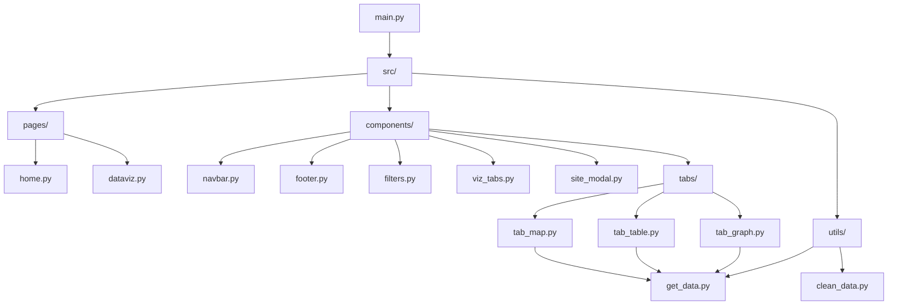

# UNESCO World Heritage Sites Dashboard

Dashboard interactif de visualisation des sites du patrimoine mondial de l'UNESCO, développé avec Python, Dash et Plotly.

## Table des matières
- [User Guide](#user-guide)
- [Data](#data)
- [Developer Guide](#developer-guide)
- [Rapport d'analyse](#rapport-danalyse)
- [Copyright](#copyright)

---
## Démonstration

Regardez la présentation du projet en vidéo :

[](https://www.youtube.com/watch?v=G38z7RNeb9Q)

*Cliquez sur l'image pour voir la vidéo sur YouTube*

## User Guide

### Prérequis
- Python 3.13.7
- pip

### Installation

1. **Cloner le dépôt**
```bash
git clone https://github.com/EmmanuelVidrean/UE-Projet-Multidisciplinaire-1.git
cd UE-Projet-Multidisciplinaire-1
```

2. **Créer un environnement virtuel (recommandé)**
```bash
python -m venv .venv
```

3. **Activer l'environnement virtuel**
- Windows PowerShell :
```powershell
.\.venv\Scripts\Activate.ps1
```
- Windows CMD :
```cmd
.venv\Scripts\activate.bat
```
- Linux/Mac :
```bash
source .venv/bin/activate
```

4. **Installer les dépendances**
```bash
python -m pip install -r requirements.txt
```

### Lancement du dashboard

```bash
python main.py
```

Le dashboard sera accessible à l'adresse : **http://127.0.0.1:8050/**

### Utilisation du dashboard

Le dashboard se compose de deux pages principales :

#### 1. Page d'accueil (Home)
- Présentation du projet
- Introduction aux sites UNESCO

#### 2. Page Data Visualization
Accessible via le menu de navigation, cette page propose trois onglets :

**Onglet Map (Carte)**
- Carte interactive du monde affichant tous les sites UNESCO
- Cliquez sur un point pour afficher les détails du site dans une fenêtre modale
- Les sites sont géolocalisés par leurs coordonnées GPS

**Onglet Table (Tableau)**
- Tableau interactif listant tous les sites
- Pagination intégrée

**Onglet Charts (Graphiques)**
- **Scatter plot** : Superficie moyenne vs Année d'inscription moyenne par pays (top 50)
- **Graphique en barres empilées** : Distribution des sites par catégorie pour les 30 premiers pays
- **Histogramme** : Distribution des sites par tranche de superficie

**Filtres disponibles (s'appliquent à tous les onglets)**
- Catégorie (Culturel, Naturel, Mixte)
- Pays
- Région géographique
- Recherche par nom de site
- Plage d'années d'inscription

### Mode hors ligne
Le dashboard peut fonctionner sans connexion internet grâce aux données locales stockées dans `data/cleaned/cleaned_data.csv`.

---

## Data

### Source des données

**Dataset principal** : UNESCO World Heritage Sites 2019
- **Source** : [Kaggle - UNESCO World Heritage Sites](https://www.kaggle.com/datasets/ujwalkandi/unesco-world-heritage-sites)
- **Format** : CSV
- **Licence** : Open Data
- **Dernière mise à jour** : 2019

### Description des données

Le dataset contient des informations sur tous les sites du patrimoine mondial de l'UNESCO :

**Nombre d'observations** : ~1100 sites (après nettoyage)

**Variables principales** :
- `unique_number` : Identifiant unique du site
- `name_en` : Nom du site en anglais
- `category` : Type de site (Cultural, Natural, Mixed)
- `states_name_en` : Pays où se trouve le site
- `region_en` : Région géographique
- `longitude` / `latitude` : Coordonnées GPS
- `area_hectares` : Superficie en hectares
- `date_inscribed` : Année d'inscription au patrimoine mondial
- `short_description_en` : Description courte du site
- `justification_en` : Justification de l'inscription

### Structure des données dans le projet

```
data/
├── raw/
│   └── whc-sites-2019 - whc-sites-2019.csv  # Données brutes originales
└── cleaned/
    └── cleaned_data.csv                      # Données nettoyées
```

### Processus de nettoyage

Le script `src/utils/clean_data.py` effectue les opérations suivantes :
1. Suppression des lignes avec coordonnées GPS manquantes
2. Conversion des colonnes numériques (longitude, latitude, area_hectares)
3. Suppression des lignes avec valeurs invalides après conversion
4. Export vers `data/cleaned/cleaned_data.csv`

Pour nettoyer les données manuellement :
```bash
python -c "from src.utils.clean_data import clean_data; clean_data()"
```

---

## Developer Guide

### Architecture du code

Le projet suit une architecture modulaire :



### Structure des dossiers

```
UE-Projet-Multidisciplinaire-1/
├── .gitignore                       # Fichiers git à ignorer
├── main.py                          # Point d'entrée de l'application
├── README.md                        # Documentation
├── requirements.txt                 # Dépendances Python
├── assets/                          # Images et fichiers statiques
├── data/
│   ├── cleaned/                     # Données nettoyées
│   │   └── cleaned_data.csv
│   └── raw/                         # Données brutes
│       └── whc-sites-2019 - whc-sites-2019.csv
└── src/
    ├── __init__.py
    ├── components/                  # Composants
    │   ├── __init__.py
    │   ├── filters.py               # Barre de filtres
    │   ├── footer.py                # Pied de page
    │   ├── navbar.py                # Barre de navigation
    │   ├── site_modal.py            # Modale d'information
    │   ├── viz_tabs.py              # Onglets de visualisation
    │   └── tabs/                    # Sous-onglets
    │       ├── tab_graph.py         # Onglet graphiques
    │       ├── tab_map.py           # Onglet carte
    │       └── tab_table.py         # Onglet tableau
    ├── pages/                       # Pages du dashboard
    │   ├── __init__.py
    │   ├── dataviz.py               # Page de visualisation
    │   └── home.py                  # Page d'accueil
    └── utils/                       # Fonctions utilitaires
        ├── __init__.py
        ├── clean_data.py            # Nettoyage des données
        └── get_data.py              # Chargement des données
```

### Guide pour ajouter une nouvelle page

1. **Créer le fichier de la page** dans `src/pages/`
```python
# src/pages/ma_nouvelle_page.py
from dash import html

def layout():
    return html.Div([
        html.H1("Ma Nouvelle Page"),
        html.P("Contenu de la page")
    ])
```

2. **Importer la page** dans `main.py`
```python
from src.pages.ma_nouvelle_page import layout as ma_page_layout
```

3. **Ajouter la route** dans le callback de `main.py`
```python
@app.callback(
    Output("page-content", "children"),
    Input("url", "pathname"),
)
def display_page(pathname: str):
    if pathname == "/dataviz":
        return dataviz_layout()
    elif pathname == "/ma-nouvelle-page":
        return ma_page_layout()
    return home_layout()
```

4. **Ajouter un lien** dans la navbar (`src/components/navbar.py`)

### Guide pour ajouter un nouveau graphique

1. **Dans un onglet existant** (ex: `src/components/tabs/tab_graph.py`)
```python
# Ajouter dans la fonction layout()
dcc.Graph(
    id='mon-nouveau-graphique',
    style={'height': '600px', 'marginTop': '40px'}
)
```

2. **Créer le callback associé**
```python
@callback(
    Output('mon-nouveau-graphique', 'figure'),
    Input('filter-category', 'value'),
    # Autres inputs...
)
def update_mon_graphique(category, ...):
    df = load_unesco_data().copy()
    # Appliquer les filtres...
    
    fig = px.bar(df, x='colonne_x', y='colonne_y')
    return fig
```

### Technologies utilisées

- **Python 3.13.7** : Langage principal
- **Dash** : Framework web pour Python
- **Plotly** : Bibliothèque de visualisation interactive
- **Pandas** : Manipulation et analyse de données
- **dash-bootstrap-components** : Composants Bootstrap pour Dash

## Rapport d'analyse

### Contexte et objectif

L'UNESCO recense plus de 1000 sites du patrimoine mondial répartis dans le monde entier. Ce dashboard permet de comparer les pays/régions possédant ces sites à travers des visualisations interactives pour mieux comprendre la distribution géographique, temporelle et thématique de ces sites.

### Principales conclusions

#### 1. Distribution géographique

**Concentration en Europe et Amérique du nord**
- Les pays européens notamment l'Italie, l'Espagne et la France dominent largement avec plus de 40 sites chacun
- Déséquilibre notable entre les continents : l'Europe et l'Amérique du nord possèdent ~50% des sites mondiaux

**Autres régions**
- Asie et le Pacifique : forte représentation avec la Chine (plus de 50 sites), l'Inde (37 sites)
- Amérique latine et Caraibes : présence notable mais inférieure à l'Europe et l'Amérique du nord
- Afrique et États Arabes : sous-représentation malgré leur richesse culturelle

#### 2. Types de sites

**Prédominance culturelle**
- Les sites culturels représentent ~75% des inscriptions
- Les sites naturels : ~20%
- Les sites mixtes (culturel + naturel) : ~5%

**Explication** : Le patrimoine architectural et historique est plus facilement identifiable et documentable que les sites naturels.

#### 3. Évolution temporelle

**Tendances d'inscription**
- Pic d'inscriptions dans les années 1980-1990 (lancement du programme)
- Ralentissement progressif dans les années 2000-2010
- Année moyenne d'inscription : environ 1995

#### 4. Superficies des sites

**Grande variabilité**
- La majorité des sites ont une superficie < 100 km²
- Quelques très grands sites naturels (parcs nationaux) dépassent 10 000 km²
- Les sites culturels sont généralement plus petits (centres historiques, monuments)
- Plus le temps avance, moins les sites sont grands (on constate tres peu de grands sites récents)

**Distribution**
- 0-10 km² : sites urbains et monuments (majoritaires)
- 100-1000 km² : sites naturels de taille moyenne
- 1000 km² et plus : grands parcs nationaux et réserves naturelles

#### 5. Relation superficie/année d'inscription

**Observation du scatter plot**
- Les sites plus anciens (inscrits avant 1990) ont tendance à avoir des superficies plus grandes
- Les inscriptions récentes concernent davantage de petits sites culturels urbains
- Pas de corrélation forte entre superficie et année, mais tendance observable

## Copyright

### Déclaration d'originalité

Nous déclarons sur l'honneur que le code fourni a été produit par nous-même.
